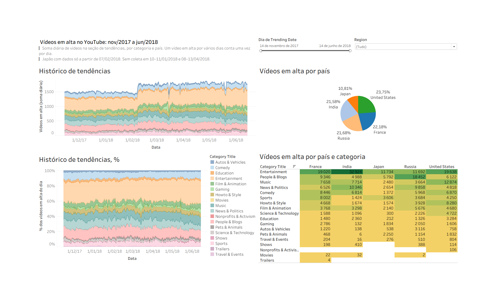

# Sprint 12 — Dashboard de vídeos em alta no YouTube (Tableau)

Projeto do curso de Data Analytics da [TripleTen](https://tripleten.com/), por **Luiz Trajano**.

Dashboard em Tableau Public para os gerentes de planejamento de anúncios em vídeo da agência
Sterling & Draper. Toda semana eles perguntam as mesmas três coisas: quais categorias de vídeo
estão em alta, como elas se distribuem entre os países e o que é popular nos Estados Unidos.
O dashboard responde isso sozinho, com filtro de período e de país.

**Dashboard:** https://public.tableau.com/views/VdeosemaltanoYouTubeSterlingDraperSprint12/DashboarddeApresentao

> **Status:** aprovado na revisão da TripleTen (2026-09-24). Dashboard publicado, apresentação em
> PDF e validação dos números em pandas.



## Estrutura do projeto

```
├── data/
│   └── trending_by_time.csv    # dados carregados no dashboard
├── docs/
│   └── rascunho_dashboard.png  # layout pedido pelos gerentes
├── notebooks/
│   └── validacao.ipynb         # conferência dos números em pandas
├── tableau/
│   └── youtube_trending_dashboard.twbx
├── images/                     # capturas do dashboard
├── presentation/
│   └── apresentacao.pdf        # respostas às três perguntas, com os gráficos
├── .gitignore
├── LICENSE                     # MIT
└── README.md
```

## Os dados

`trending_by_time.csv` — 12.343 registros diários de vídeos em alta por país e categoria,
de 14/11/2017 a 14/06/2018. Sem nulos e sem duplicados em (país, data, categoria).

| coluna | descrição |
|---|---|
| `record_id` | chave primária |
| `region` | país (França, Índia, Japão, Rússia, Estados Unidos) |
| `trending_date` | data da tendência (todas as horas são 00:00, a granularidade real é diária) |
| `category_title` | categoria do vídeo (18) |
| `videos_count` | número de vídeos na seção de tendências naquele dia |

## O dashboard

Montado a partir do rascunho combinado com os gerentes, em grade 2 × 2 e tamanho fixo:

| Visualização | Como foi construída |
|---|---|
| Histórico de tendências | área empilhada, `trending_date` contínuo por dia × `SUM(videos_count)`, cor por categoria |
| Histórico de tendências, % | mesma área, com percentual do total calculado ao longo das categorias: cada dia soma 100% |
| Vídeos em alta por país | pizza com rótulo em % do total |
| Vídeos em alta por país e categoria | tabela de realce, países nas colunas e categorias nas linhas |

O filtro de data é contínuo (intervalo, não lista de caixas) e, junto com o filtro de país, está
aplicado a todas as planilhas que usam a fonte de dados. Mexer num deles muda os quatro gráficos.

## Antes de ler os números

Três ressalvas mudam a leitura do painel. Estão no notebook, na apresentação e no `readme.txt` da
entrega.

- **A métrica é vídeo-dia, não vídeo único.** Um vídeo em alta por cinco dias entra cinco vezes.
  O total de 339.990 é uma soma diária, e a base não tem coluna de audiência: chamar isso de
  "visualizações" seria inventar uma métrica.
- **O Japão só tem dados a partir de 07/02/2018**, 122 dias contra 205 dos outros países. No
  período inteiro ele aparece com 10,8%; no período em que todos têm coleta, sobe para 17,0%.
- **Oito dias sem coleta:** 10 e 11/01/2018 e de 08 a 13/04/2018. Numa área contínua o buraco
  vira uma queda que parece fenômeno.

## Respostas às perguntas dos gerentes

**1. Quais categorias estão em alta?** Entertainment lidera com 27,9% do total e é a primeira em
quatro dos cinco países; na Rússia, People & Blogs fica à frente com 25,0%. Depois vêm People &
Blogs (13,1%), Music (10,1%) e News & Politics (10,1%). A pergunta original fala da "semana
passada", sem data de referência, então fixei a última semana da base (08 a 14/06/2018): ali
Entertainment tem 30,6% e **Music (12,1%) passa People & Blogs (11,1%)**. O recorte muda a ordem.

**2. Como se distribuem entre as regiões?** Estados Unidos (23,8%), França, Rússia e Índia ficam
entre 21,6% e 23,8%. O Japão com 10,8% é efeito de calendário, não de consumo menor.

**3. O que é popular nos EUA e difere do resto?** A comparação é em pontos percentuais da
participação dentro de cada grupo, não em contagem absoluta, para o maior mercado não parecer
"maior em tudo". Nos EUA, Music (+7,6 p.p.), Howto & Style (+5,7 p.p.) e Science & Technology
(+3,8 p.p.) pesam mais; People & Blogs (−7,3 p.p.), News & Politics (−5,4 p.p.) e Entertainment
(−4,8 p.p.) pesam menos.

## Validação

Cada número da apresentação foi conferido em pandas (`notebooks/validacao.ipynb`) e bate com o
dashboard: total, ranking de categorias, distribuição por país no período inteiro e no período
comum, a semana de 08 a 14/06 e a diferença EUA × outros países.

## Tecnologias utilizadas

- Tableau Desktop Public Edition e Tableau Public
- Python (pandas) e Jupyter Notebook — validação

## Como abrir

1. Abra o link do dashboard em qualquer navegador; não precisa de conta.
2. Para editar, abra `tableau/youtube_trending_dashboard.twbx` no Tableau Desktop ou no Public
   Edition gratuito. O arquivo já traz os dados.
3. Para refazer a validação: `pip install pandas jupyter` e execute `notebooks/validacao.ipynb`.
